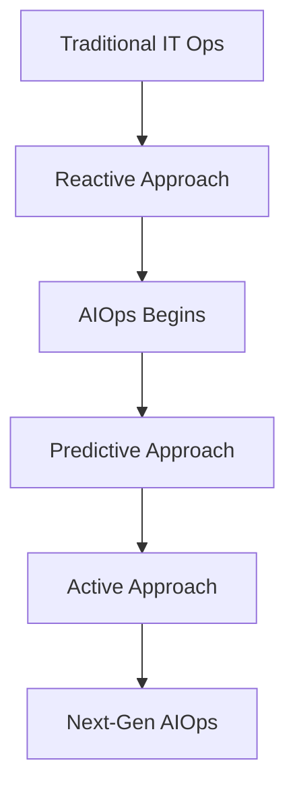

## 🧠 What is AIOps?
- **Definition**: AIOps combines big data, ML, and automation to improve IT operations.  
- **Core capabilities**:
  - Intelligent monitoring
  - Automated root cause analysis
  - Predictive scaling
  - Incident response automation
  - Log analysis & anomaly detection

---

## 🏗️ Key Components
| Component              | Role in AIOps                                      |
|------------------------|----------------------------------------------------|
| **Data Ingestion**     | Collect logs, metrics, traces from infra & apps    |
| **ML/LLM Models**      | Detect anomalies, predict failures, generate fixes |
| **Automation Engine**  | Execute remediation actions (restart, scale, patch)|
| **Visualization**      | Dashboards for insights & decision-making          |

---

## Traditional IT Ops vs AIOps Maturity Model

---

### 🔎 How to Interpret
- **Traditional IT Ops** → purely reactive firefighting.  
- **Reactive Approach** → still traditional, but AI helps triage faster.  
- **AIOps Begins** → at **Predictive**, when AI starts forecasting anomalies.  
- **Active Approach** → full AIOps maturity, with autonomous remediation and self-healing.  
- **Future** → next-gen AIOps, combining predictive + active with advanced governance.  

---
