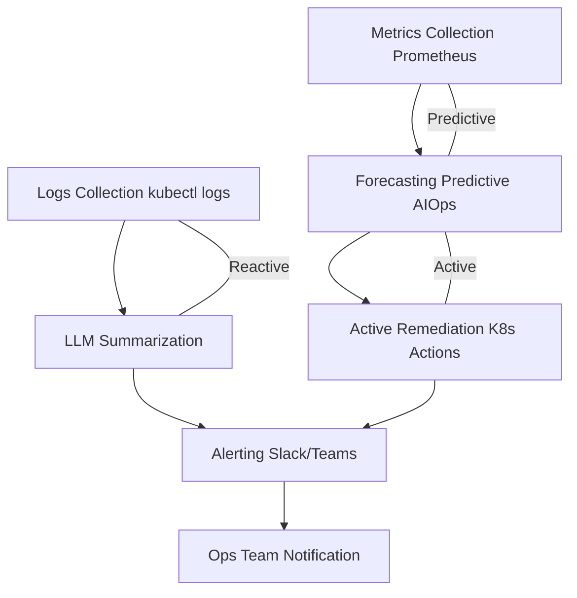

### 🧠 Logic Flow for Log Analysis
1. Data Ingestion
   - Collect logs from Kubernetes pods, containers, or applications.
   - Example sources: kubectl logs, ELK stack, or Prometheus exporters.
2. Preprocessing
   - Clean logs (remove timestamps, metadata).
   - Normalize into structured format (JSON or plain text lines).
3. AI/LLM Summarization
   - Feed logs into an LLM (hosted like OpenAI, or local like LLaMA).
   - Ask the model to:
     - Summarize errors.
     - Highlight anomalies.
     - Suggest root causes.
4. Noise Reduction
   - Cluster repetitive errors (e.g., 100 “connection refused” → 1 summary).
   - Filter out non-critical info (debug-level logs).
5. Output
   - Human-friendly summary: “Pod nginx-123 failed due to memory leak at 02:15 AM.”
   - Optional: Trigger alert or remediation workflow.

---
## 🐍 Sample Python Project 1: Log Summarizer (Reactive AIOps Project)
Here’s a simple demo using OpenAI GPT for hosted LLMs. You can adapt it later for local models.
```
import os
from openai import OpenAI

# Initialize client
client = OpenAI(api_key=os.getenv("OPENAI_API_KEY"))

# Step 1: Collect logs (simulate with sample logs)
logs = """
2026-06-05 08:00:12 ERROR Pod nginx-123 OOMKilled
2026-06-05 08:00:13 INFO Restarting container nginx-123
2026-06-05 08:00:14 ERROR Pod nginx-123 OOMKilled
2026-06-05 08:00:15 INFO Restarting container nginx-123
"""

# Step 2: Ask LLM to summarize
response = client.chat.completions.create(
    model="gpt-4",
    messages=[
        {"role": "system", "content": "You are an AIOps assistant that summarizes logs."},
        {"role": "user", "content": f"Summarize the following logs and highlight anomalies:\n{logs}"}
    ]
)

# Step 3: Print summary
print("AI Summary:")
print(response.choices[0].message.content)

```
### 🚀 Next Steps
- Replace sample logs with real Kubernetes logs (kubectl logs <pod>).
- Add alerting (send summary to Slack/Teams).
- Extend with auto-remediation (trigger pod restart if OOMKilled detected).


## ✅ Expected Output
Instead of raw logs, you’ll get something like:
```
AI Summary:
Pod nginx-123 experienced repeated OOMKilled errors at 08:00 AM.
The container was restarted twice but continues to fail due to memory issues.
Root cause likely: insufficient memory allocation.
```
---
## 🐍 Sample Python Project 2 : Real Kubernetes Logs + Alerting + Auto-Heal(Reactive → Active AIOps pipeline)
## Log Analysis & Noise Reduction demo into a more real-world AIOps project by adding three layers:
- Replace sample logs with real Kubernetes logs
- Add alerting (Slack/Teams integration)
- Extend with auto-remediation (restart pod if OOMKilled)
```
import os
import subprocess
import requests
from openai import OpenAI

 # Initialize OpenAI client
 client = OpenAI(api_key=os.getenv("OPENAI_API_KEY"))

# Step 1: Collect logs from Kubernetes pod
pod_name = "nginx-123"
namespace = "default"
logs = subprocess.getoutput(f"kubectl logs {pod_name} -n {namespace}")

# Step 2: Summarize logs with LLM
response = client.chat.completions.create(
    model="gpt-4",
    messages=[
        {"role": "system", "content": "You are an AIOps assistant that summarizes logs."},
        {"role": "user", "content": f"Summarize the following logs and highlight anomalies:\n{logs}"}
    ]
)

summary = response.choices[0].message.content
print("AI Summary:\n", summary)

# Step 3: Send summary to Slack/Teams
slack_webhook = os.getenv("SLACK_WEBHOOK_URL")
if slack_webhook:
    requests.post(slack_webhook, json={"text": f"AIOps Summary for {pod_name}:\n{summary}"})

# Step 4: Auto-remediation if OOMKilled detected
if "OOMKilled" in logs:
    print(f"Pod {pod_name} detected OOMKilled. Restarting...")
    subprocess.run(f"kubectl delete pod {pod_name} -n {namespace}", shell=True)

```
#### ✅ Expected Behavior
- Fetches real logs from Kubernetes.
- Summarizes anomalies using LLM.
- Sends a Slack/Teams alert with the AI summary.
- If OOMKilled is detected → pod is restarted automatically.
#### Code turn into : Reactive → Active AIOps pipeline
- Reactive: Summarize logs.
- Predictive: Extend later with anomaly forecasting.
- Active: Auto-remediation via Kubernetes restart.
---
## 🐍 Sample Python Project 3: Prometheus + Predictive AIOps
 Reactive AIOps log analysis demo into Predictive AIOps by integrating Prometheus metrics. This way, instead of only reacting to OOMKilled errors, your system can forecast them before they happen.
 
#### 🧠 Logic Flow with Prometheus
1. Collect Metrics
- Use Prometheus to scrape Kubernetes metrics (CPU, memory, pod restarts).
- Query Prometheus via its HTTP API from Python.
2. Analyze Trends
- Feed metrics into an LLM or ML model.
- Example: Detect memory usage trending upward toward container limits.
3. Forecast Anomalies
- Predict when a pod will hit OOMKilled based on usage trajectory.
- Example: “Pod nginx-123 will likely exceed memory in ~30 minutes.”
4. Alert & Remediate
- Send forecast to Slack/Teams.
- Trigger proactive scaling or resource adjustment before failure.

```
import os
import requests
from datetime import datetime, timedelta
from openai import OpenAI

# Initialize OpenAI client
client = OpenAI(api_key=os.getenv("OPENAI_API_KEY"))

# Step 1: Query Prometheus for memory usage
PROMETHEUS_URL = "http://localhost:9090/api/v1/query"
query = 'container_memory_usage_bytes{pod="nginx-123"}'

response = requests.get(PROMETHEUS_URL, params={'query': query})
result = response.json()['data']['result']

# Extract metric values
metrics = []
for r in result:
    metrics.append(float(r['value'][1]))

# Step 2: Summarize trend with LLM
summary_prompt = f"""
Pod nginx-123 memory usage metrics: {metrics}.
Analyze the trend and predict if OOMKilled is likely soon.
"""

llm_response = client.chat.completions.create(
    model="gpt-4",
    messages=[
        {"role": "system", "content": "You are an AIOps assistant that forecasts anomalies."},
        {"role": "user", "content": summary_prompt}
    ]
)

summary = llm_response.choices[0].message.content
print("AI Forecast:\n", summary)

# Step 3: Send forecast to Slack
slack_webhook = os.getenv("SLACK_WEBHOOK_URL")
if slack_webhook:
    requests.post(slack_webhook, json={"text": f"AIOps Forecast for nginx-123:\n{summary}"})

# Step 4: Proactive remediation (scale pod if risk detected)
if "OOMKilled likely" in summary or "memory exhaustion" in summary:
    print("Scaling pod proactively...")
    os.system("kubectl scale deployment nginx --replicas=3 -n default")
```
✅ Expected Behavior
- Pulls real-time metrics from Prometheus.
- AI forecasts anomalies (e.g., memory exhaustion).
- Sends forecast alerts to Slack/Teams.
- Proactively scales pods before they crash.
---
## 🐍 Sample Python Project: Active AIOps (Self-Healing)
#### 🧠 Logic Flow for Active AIOps
1. Monitor Metrics (Prometheus)
- Continuously query Prometheus for CPU, memory, and pod health.
2. Forecast Issues (Predictive)
- Use AI/ML to detect trends (e.g., memory exhaustion).
3. Trigger Automated Remediation (Active)
- If risk is high → automatically adjust Kubernetes resources or restart pods.
- Examples:
  - Scale deployment replicas.
  - Increase memory limits.
  - Restart unhealthy pods.
4. Notify Teams
- Send proactive alerts to Slack/Teams with details of the action taken.
```
import os
import requests
import subprocess
from openai import OpenAI

# Initialize OpenAI client
client = OpenAI(api_key=os.getenv("OPENAI_API_KEY"))

PROMETHEUS_URL = "http://localhost:9090/api/v1/query"
pod_name = "nginx-123"
namespace = "default"

# Step 1: Query Prometheus for memory usage
query = f'container_memory_usage_bytes{{pod="{pod_name}"}}'
response = requests.get(PROMETHEUS_URL, params={'query': query})
result = response.json()['data']['result']

metrics = [float(r['value'][1]) for r in result]

# Step 2: Forecast anomalies with LLM
prompt = f"""
Pod {pod_name} memory usage metrics: {metrics}.
Predict if memory exhaustion or OOMKilled is likely soon.
If yes, suggest remediation.
"""

llm_response = client.chat.completions.create(
    model="gpt-4",
    messages=[
        {"role": "system", "content": "You are an AIOps assistant that forecasts and remediates anomalies."},
        {"role": "user", "content": prompt}
    ]
)

summary = llm_response.choices[0].message.content
print("AI Forecast:\n", summary)

# Step 3: Active remediation
if "OOMKilled likely" in summary or "memory exhaustion" in summary:
    print(f"Proactive remediation triggered for {pod_name}...")
    # Option 1: Scale deployment
    subprocess.run("kubectl scale deployment nginx --replicas=3 -n default", shell=True)
    # Option 2: Restart pod
    subprocess.run(f"kubectl delete pod {pod_name} -n {namespace}", shell=True)

# Step 4: Notify Slack/Teams
slack_webhook = os.getenv("SLACK_WEBHOOK_URL")
if slack_webhook:
    requests.post(slack_webhook, json={"text": f"AIOps Active Remediation for {pod_name}:\n{summary}"})
```

# End-to-End AIOps Workflow

---
## Project : complete AIOps demo project
1. Add policy guardrails (e.g., only scale if CPU > 90% for 5 minutes).
2. Integrate with Kubernetes HPA/VPA for smarter scaling.
3. Extend remediation to patch resource limits dynamically.
4. Add audit logging for all AI-driven actions.
#### 1️⃣ Policy Guardrails
Why: Prevent false positives or runaway automation.
How: Add thresholds and time windows before triggering remediation.
Example (Python snippet):

```python
# Only scale if CPU > 90% for 5 minutes
cpu_query = 'container_cpu_usage_seconds_total{pod="nginx-123"}'
cpu_result = requests.get(PROMETHEUS_URL, params={'query': cpu_query}).json()

cpu_values = [float(r['value'][1]) for r in cpu_result['data']['result']]
if all(val > 0.9 for val in cpu_values[-5:]):  # last 5 minutes
    subprocess.run("kubectl scale deployment nginx --replicas=3 -n default", shell=True)
```
#### 2️⃣ Integrate with Kubernetes HPA/VPA
Horizontal Pod Autoscaler (HPA) → scales pods based on CPU/memory.
Vertical Pod Autoscaler (VPA) → adjusts resource requests/limits dynamically.
Integration: Instead of manual scaling, your AIOps agent can patch HPA/VPA configs when forecasts show risk.

```bash
kubectl autoscale deployment nginx --cpu-percent=80 --min=2 --max=10
```
#### 3️⃣ Dynamic Resource Patching
Why: Sometimes scaling pods isn’t enough — you need to increase memory/CPU limits.
How: Use kubectl patch to adjust resource limits automatically.
```python
subprocess.run("""
kubectl patch deployment nginx -n default \
  -p '{"spec":{"template":{"spec":{"containers":[{"name":"nginx","resources":{"limits":{"memory":"512Mi"}}}]}}}}'
""", shell=True)
```

#### 4️⃣ Audit Logging for AI Actions
Why: Track every AI‑driven decision for compliance and debugging.
How: Write logs to a file or push them to ELK/Prometheus.
```python
import logging
logging.basicConfig(filename="aiops_audit.log", level=logging.INFO)

logging.info(f"Remediation triggered for {pod_name} at {datetime.now()}: {summary}")
```
### Full Code: End-to-End AIOps Demo
```
import os
import requests
import subprocess
import logging
from datetime import datetime
from openai import OpenAI

# --- Setup ---
PROMETHEUS_URL = "http://localhost:9090/api/v1/query"
pod_name = "nginx-123"
namespace = "default"

# Initialize OpenAI client
client = OpenAI(api_key=os.getenv("OPENAI_API_KEY"))

# Setup audit logging
logging.basicConfig(filename="aiops_audit.log", level=logging.INFO)


# --- Step 1: Collect Logs (Reactive) ---
def get_pod_logs(pod, ns):
    return subprocess.getoutput(f"kubectl logs {pod} -n {ns}")


# --- Step 2: Summarize Logs with LLM ---
def summarize_logs(logs):
    response = client.chat.completions.create(
        model="gpt-4",
        messages=[
            {"role": "system", "content": "You are an AIOps assistant that summarizes logs."},
            {"role": "user", "content": f"Summarize the following logs and highlight anomalies:\n{logs}"}
        ]
    )
    return response.choices[0].message.content


# --- Step 3: Query Prometheus Metrics (Predictive) ---
def query_prometheus(query):
    response = requests.get(PROMETHEUS_URL, params={'query': query})
    return response.json()['data']['result']


def forecast_anomalies(metrics):
    prompt = f"""
    Metrics: {metrics}.
    Predict if memory exhaustion or OOMKilled is likely soon.
    Suggest remediation if needed.
    """
    response = client.chat.completions.create(
        model="gpt-4",
        messages=[
            {"role": "system", "content": "You are an AIOps assistant that forecasts anomalies."},
            {"role": "user", "content": prompt}
        ]
    )
    return response.choices[0].message.content


# --- Step 4: Active Remediation with Guardrails ---
def remediate(summary, pod, ns):
    if "OOMKilled likely" in summary or "memory exhaustion" in summary:
        logging.info(f"Remediation triggered for {pod} at {datetime.now()}: {summary}")
        print(f"Proactive remediation triggered for {pod}...")

        # Guardrail: Only act if CPU > 90% for last 5 minutes
        cpu_query = f'container_cpu_usage_seconds_total{{pod="{pod}"}}'
        cpu_result = query_prometheus(cpu_query)
        cpu_values = [float(r['value'][1]) for r in cpu_result]

        if len(cpu_values) >= 5 and all(val > 0.9 for val in cpu_values[-5:]):
            # Option 1: Scale deployment via HPA
            subprocess.run("kubectl autoscale deployment nginx --cpu-percent=80 --min=2 --max=10 -n default", shell=True)

            # Option 2: Restart pod
            subprocess.run(f"kubectl delete pod {pod} -n {ns}", shell=True)

            # Option 3: Patch resource limits dynamically
            subprocess.run("""
            kubectl patch deployment nginx -n default \
              -p '{"spec":{"template":{"spec":{"containers":[{"name":"nginx","resources":{"limits":{"memory":"512Mi"}}}]}}}}'
            """, shell=True)


# --- Step 5: Send Alerts ---
def send_alert(summary, pod):
    slack_webhook = os.getenv("SLACK_WEBHOOK_URL")
    if slack_webhook:
        requests.post(slack_webhook, json={"text": f"AIOps Summary for {pod}:\n{summary}"})


# --- Main Workflow ---
if __name__ == "__main__":
    # Reactive: Logs
    logs = get_pod_logs(pod_name, namespace)
    log_summary = summarize_logs(logs)
    print("Log Summary:\n", log_summary)
    send_alert(log_summary, pod_name)

    # Predictive: Metrics
    mem_query = f'container_memory_usage_bytes{{pod="{pod_name}"}}'
    mem_result = query_prometheus(mem_query)
    mem_values = [float(r['value'][1]) for r in mem_result]

    forecast = forecast_anomalies(mem_values)
    print("Forecast:\n", forecast)
    send_alert(forecast, pod_name)

    # Active: Remediation
    remediate(forecast, pod_name, namespace)
```
